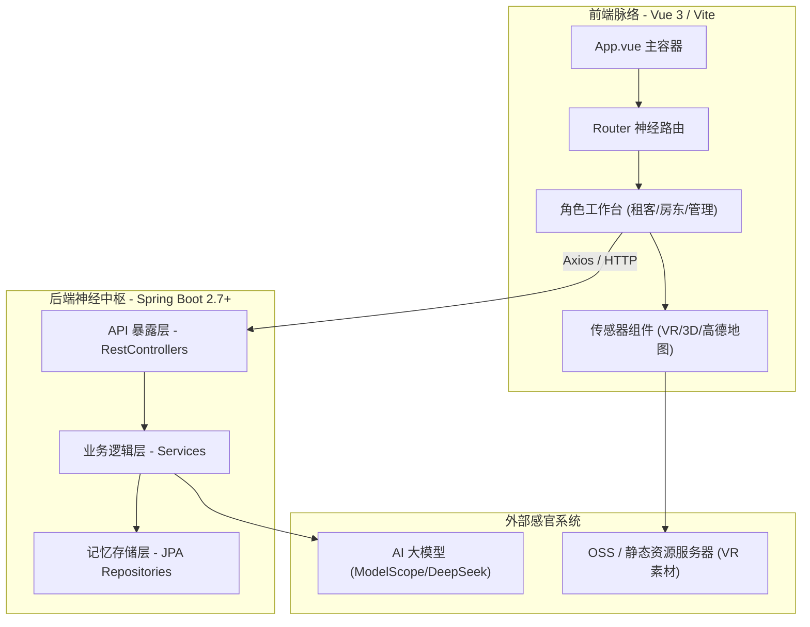
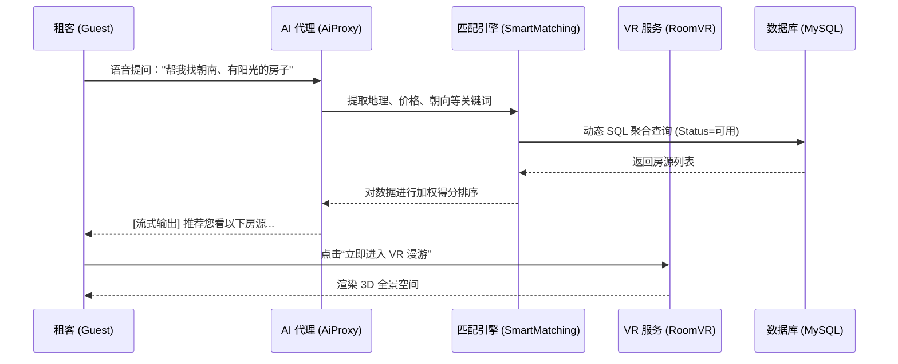

# HomeSee - 融合多模态 AI 与 Web 3D 的智能全景看房系统

[](https://github.com/)
[](https://github.com/)
[](https://github.com/)

> **开发者：** 牛迦楠 (Niu Jianan) | 东华理工大学 (ECUT)  
> **设计理念：** 工业极简 (Industrial Minimal) + 神经网络闭环 (Neural Closed Loops)

---

## 📖 项目概述 (Overview)

**HomeSee** 是一个致力于解决“看房难、选房难”痛点的下一代房屋租赁平台。它不仅仅是一个信息发布工具，而是一个集成了 **多模态大模型 (LLM)**、**Web 3D 沉浸式全景漫游**、**AI 智能语音交互** 与 **精密租务自动机** 的多维数字生态系统。

### 🚀 核心黑科技
- **AI 意图识别流式网关**：基于 ModelScope/DeepSeek，实现秒级响应的自然语言找房与视觉问答。
- **3DoF 沉浸式全景漫游**：基于 Three.js 加载 4K/8K 全景素材，配合“推拉”过渡动画，实现丝滑看房。
- **工业极简 UI 设计**：严格遵循“直角定律”，摒弃阴影与渐变，还原数据最本真的生产力感官。
- **租务全流程闭环**：从 AI 意图识别到智能匹配，再到电子签约与数字化水电维护，提供端到端服务。

---

## 🏗️ 系统神经网络架构 (System Architecture)

### 1. 全景解剖图


### 2. AI 选房业务时序图 (Core Flow)


---

## 🛠️ 技术栈 (Technology Stack)

### 前端 (Frontend)
| 类别         | 技术名称      | 说明                                       |
| :----------- | :------------ | :----------------------------------------- |
| **核心框架** | `Vue 3.5+`    | Composition API (`<script setup>`) 模式    |
| **构建工具** | `Vite 7.1+`   | 极致的编译与热更新体验                     |
| **3D 引擎**  | `Three.js`    | 负责 VR 渲染、3D 模型加载及粒子特效        |
| **图表库**   | `ECharts`     | 管理员/房东数据大屏展示                    |
| **样式规范** | `Vanilla CSS` | 严格执行 "Industrial Minimal" 工业风格协议 |

### 后端 (Backend)
| 类别           | 技术名称                | 说明                            |
| :------------- | :---------------------- | :------------------------------ |
| **核心框架**   | `Spring Boot 3.2+`      | 提供稳健的 RESTful 指令分发     |
| **数据持久化** | `Spring Data JPA`       | 基于 Hibernate 实现对象关系映射 |
| **数据库**     | `MySQL 8.0+`            | 核心业务数据存储                |
| **安全认证**   | `JWT + Spring Security` | 无状态身份认证与细粒度权限管控  |

---

## 🎨 设计哲学：工业极简风 (Industrial Minimal)

本项目坚决贯彻 **“工具属性优先”**。
- **直角定律 (Law of Squares)**：除头像外，一切容器、按钮、输入框均为严格直角，无圆角。
- **禁止阴影 (No Shadows)**：消除一切虚幻的扩散效果，使用 `1px solid` 实线分割空间。
- **圆形例外**：仅用户头像使用圆形，以在视觉上快速区分“生物”与“机器”。
- **单色体系**：采用灰度色彩管理（Gray-50 到 Gray-900），大幅降低视觉干扰。

---

## 📂 核心功能字典 (Function Dictionary)

### 1. 房源生命周期 (The Housing Link)
- **`RoomInfo`**: 多目标动态过滤系统（区域/价格/标签）。
- **`RoomVrScene`**: 房源与 3D 场景的一对多映射插件。

### 2. 租务自动机 (Rental Machine)
- **`TenantManagementService`**: 处理签约逻辑，实现水电读数等物理指标数字化。
- **`MaintenanceRequest`**: 房东与租客的报修互联桥梁。

### 3. AI 交互中枢 (AI Cognitive)
- **`AiProxyController`**: 后端转发实现流式响应，隔离并保护 API 密钥安全。
- **`ChatHistory`**: 提供对话的长短期记忆支撑，实现多轮连续问答。

---

## 🚀 快速启动 (Quick Start)

### 后端启动
```bash
cd Springboot
# 修改 application.properties 中的数据库连接
mvn clean package
java -jar target/homesee-0.0.1-SNAPSHOT.jar
```

### 前端启动
```bash
cd Vue3/frontend
npm install
npm run dev
```

---

## 🔮 未来愿景 (Vision)
- [ ] **3D Gaussian Splatting (3DGS)**：从全景图转向真正的照片级 3D 空间漫游。
- [ ] **WebGPU 渲染**：利用现代 GPU 特性，在网页端实现影视级实时渲染。
- [ ] **“贾维斯”手势交互**：利用 MediaPipe 实现空间手势操控 3D 模型。

---

## 📄 关联文档 (Documentation)
- [项目深度架构与知识图谱](./项目架构与知识图谱.md)
- [系统业务流程图](./业务流程图.md)
- [后端框架设计说明](./框架.md)
- [接口 API 完整定义](./接口文档.md)
- [个人开发风格指南](./个人开发风格.md)

---
**HomeSee - 让租房更智能，让生活更美好**  
*Update at: 2026-01-06*
