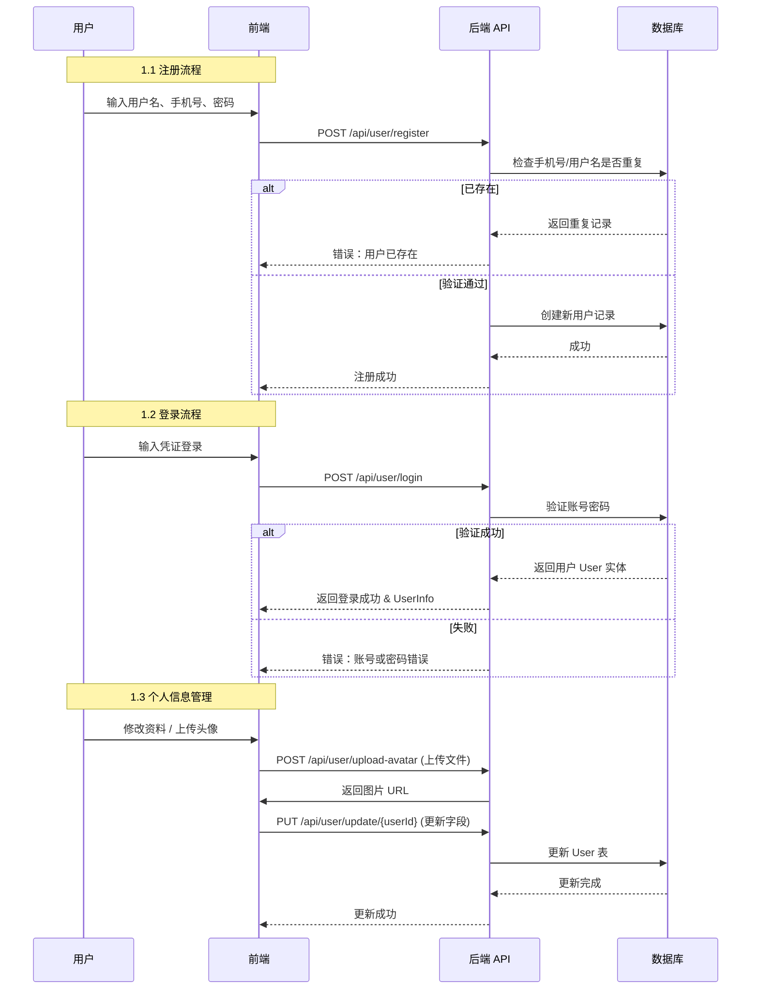
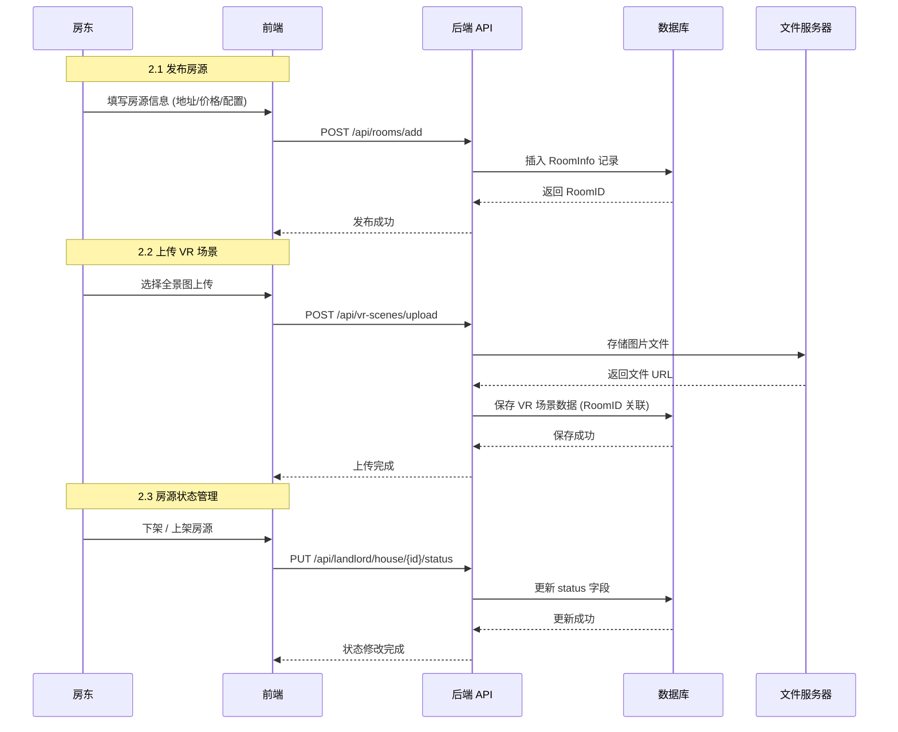
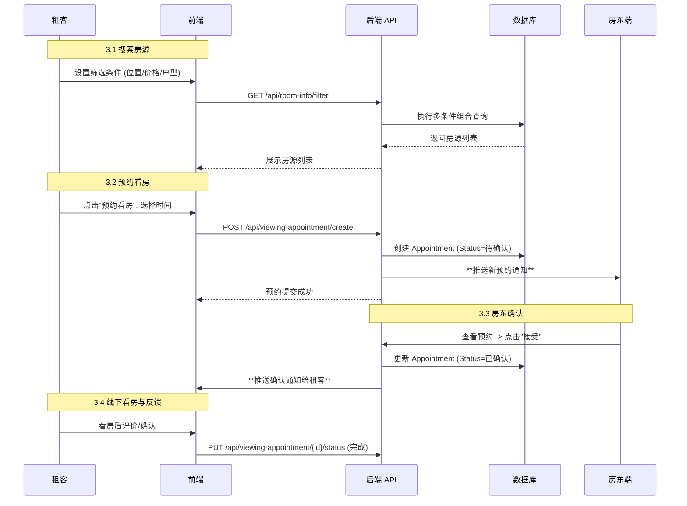
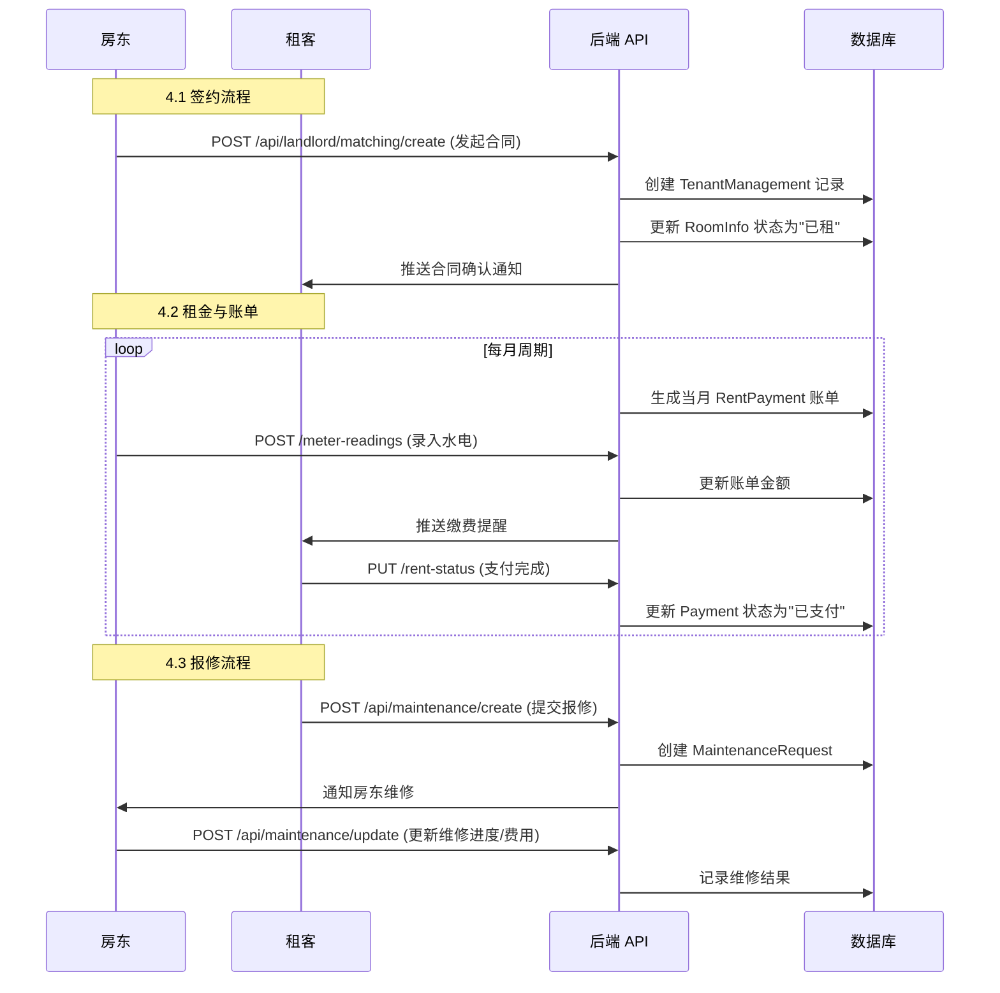
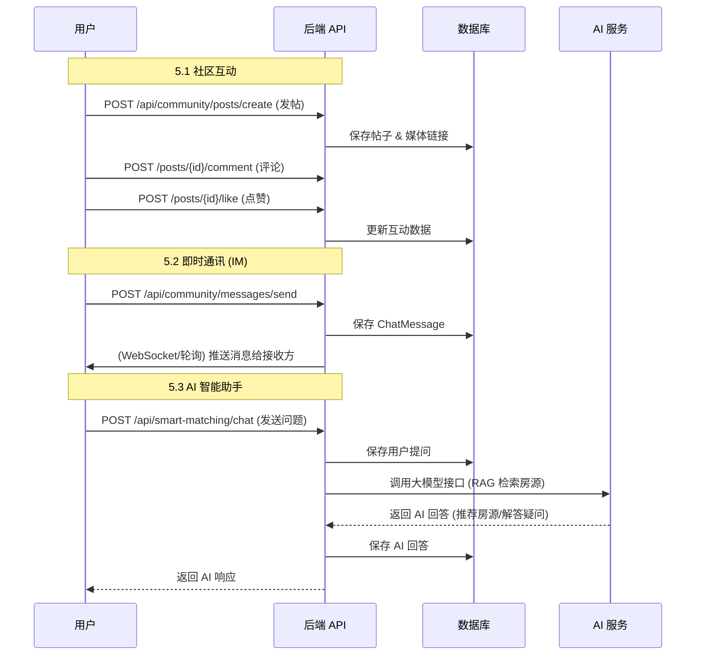
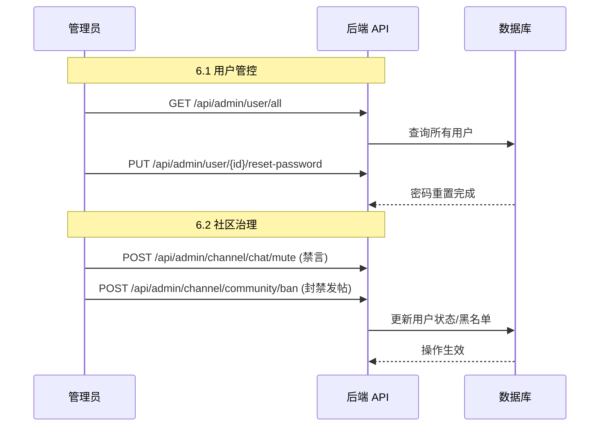

# 业务流程图

本文档包含系统核心业务模块的时序图，详细展示了前端、后端与数据库之间的交互流程。

## 1. 用户管理与认证流程
*涵盖功能：注册、登录、个人信息修改、头像上传*

## 2. 房源管理流程 (房东端)
*涵盖功能：发布房源、VR上传、状态管理*

## 3. 租客看房与预约流程
*涵盖功能：搜索筛选、详情查看、发起预约、房东确认*

## 4. 租赁合同与租务管理流程
*涵盖功能：签约、支付租金、水电抄表、报修*

## 5. 社区社交与 AI 助手
*涵盖功能：发帖、评论、点赞、聊天、AI 对话*

## 6. 管理员后台管理流程
*涵盖功能：用户管理、社区管控、全局统计*

