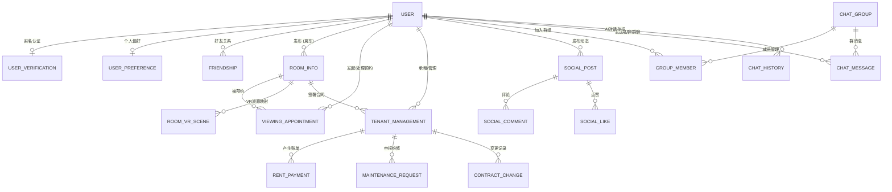

# 数据库实体关系图 (ER Diagram) - 基于 init.sql 完整版

**项目名称：** 融合大模型交互与 3D 全景预览的智能选房平台设计与实现  
**说明：** 本文档根据最新的 `init.sql` 物理架构，详细描述了系统的核心数据库逻辑结构。

---

## 1. 核心实体关系图 (Mermaid)

---

## 2. 数据表映射详解 (Mappings)

### 2.1 用户与认证 (Account & Identity)
- **`user` (用户表)**: 存储基本账号、加密密码、用户类型（租客/房东/管理员）及信用评分。
- **`user_verification` (实名认证)**: 存储身份证正反面、活体照片及审核状态。
- **`user_preference` (用户偏好)**: 存储租客对面积、电梯、朝向的偏好，以及各类通知开关。

### 2.2 房源与预约 (Housing & Appointment)
- **`room_info` (房源表)**: 存储门牌号、面积、租金、经纬度及房源状态（可租/已租/下架）。
- **`viewing_appointment` (预约看房)**: 记录预约编号、期望时间段、看房类型（现场/视频）及业务员备注。
- **`room_vr_scene` (VR资源)**: 映射 3D 场景路径与房源 ID（由 H5 端 3js 渲染驱动）。

### 2.3 租务全闭环 (Rental Lifecycle)
- **`tenant_management` (租约管理)**: 合同核心。维护合同号、租期起止、押金模式、水电初始读数。
- **`rent_payment` (支付记录)**: 记录月度账单、实缴金额、支付方式（微信/支付宝等）及滞纳金。
- **`maintenance_request` (报修表)**: 租客提交的维修申请，包含费用承担方（房东/租客/分摊）及修复日期。
- **`contract_change` (合同变更)**: 记录续租、退租、转租及租金调整的变更轨迹。

### 2.4 社交与社区 (Community)
- **`social_post` (社区动态)**: 用户发布的动态内容，支持媒体链接（JSON数组）。
- **`social_comment` / `social_like`**: 针对动态的二级交互数据。
- **`chat_group` / `group_member`**: 维护“幸福家园”大群及租客交流群的成员权限。
- **`chat_message`**: 存储私聊及群聊的消息内容、类型（文本/图/视）。

---

## 3. 约束与关联策略
1. **外键级联**：业务表（如 `tenant_management`）通过 `FOREIGN KEY` 严格约束 `room_id` 和 `user_id`，防止孤儿数据产生。
2. **唯一约束**：对 `contract_number` (合同号) 和 `appointment_number` (预约号) 强制唯一索引。
3. **性能设计**：针对地理信息（`province`, `city`, `district`）及价格（`rent_price`）建立了高效的复合索引，支撑小程序端的“地图找房”高频检索。

---
*文档维护：牛迦楠 (Niu Jianan) | ECUT*
