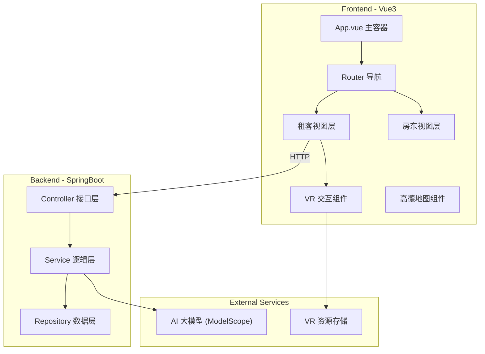
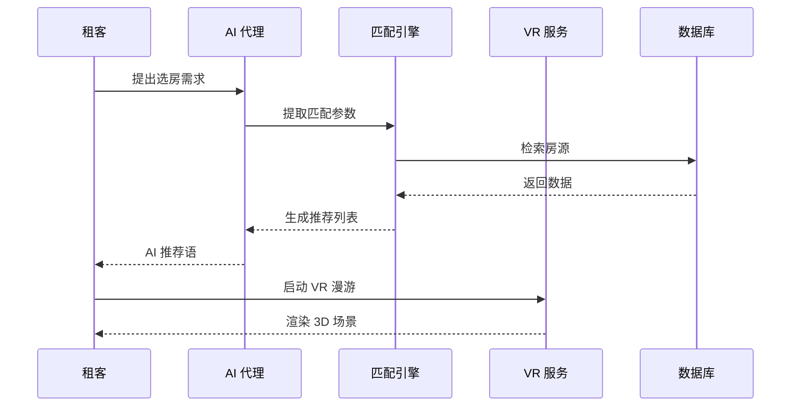
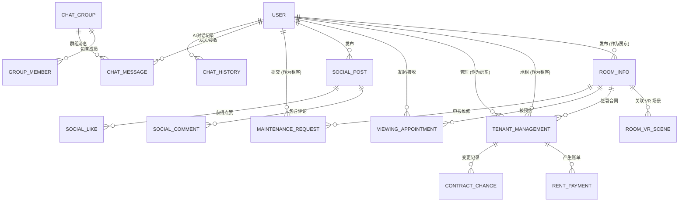

# 智能选房平台：项目神经架构图谱

> **版本：** v2.4 (Max Stability)  
> **核心架构：** Vue3 + SpringBoot + AI + VR

---

## 一、 系统全景解剖图 (System Architecture)

---

## 二、 核心业务流：AI 辅助 3D 选房 (Sequence Flow)

---

## 三、 核心文件功能实录 (Components Lexicon)

*   **`RoomInfo.java`**: 房源核心。支持区域、价格、面积的多维检索。
*   **`RoomVrScene.java`**: VR 插件。实现 3D 场景在 3js 中的映射。
*   **`TenantManagementService.java`**: 租务管家。处理签约、水电数字化及费用结算。
*   **`AiProxyController.java`**: AI 网关。后端流式转发，确保对话秒级响应并保护 API 密钥。

---

## 四、 实体关系图 (ER Map)

---

## 五、 项目核心闭环

1.  **AI-选房闭环**：通过对话意图识别（LLM）驱动房源的动态权值匹配。
2.  **3D-全景闭环**：全景图片 -> 3.js 坐标映射 -> 语音合成引导 -> 沉浸式看房。
3.  **租务管理闭环**：电子租约 -> 数字化水电仪表记录 -> 售后报修流转。

---
*文档维护：牛迦楠 (Niu Jianan) | 2026-01-06*
